# Experiment Log — Freq Reconstruction (FTM + Diffusion)

> 维护规则：每次新实验完成后在对应章节追加一行（表格）或一个小节（新实验类型）。每条记录注明日期。

---

## 目录

1. [方法说明](#1-方法说明)
2. [2D Helmholtz — 主实验](#2-2d-helmholtz--主实验)
3. [2D Helmholtz — 消融实验](#3-2d-helmholtz--消融实验)
4. [2D 弹性波](#4-2d-弹性波)
5. [3D Helmholtz](#5-3d-helmholtz)
6. [自适应引导（Self-Calibrating Guidance）实验](#6-自适应引导-self-calibrating-guidance-实验)
7. [代表性可视化图](#7-代表性可视化图)
8. [下一步计划](#8-下一步计划--对齐-aaai_planmd)

---

## 1. 方法说明

| 缩写 | 全称 | 说明 |
|------|------|------|
| **Ours** | FTM + Diffusion (DPS) | 共享连续空间基底（FTM）+ 频率条件扩散先验 + 多线性 DPS 引导 |
| LRTFR | Low-Rank Tensor Field Reconstruction | 用同一FTM基底逐样本最小二乘拟合，无扩散 |
| FNO | Fourier Neural Operator | 经典 FNO（2D或3D卷积+FFT谱混合） |
| F-FNO | Factorized FNO | 三个独立1D谱卷积，内存更小 |
| VoronoiCNN | Voronoi CNN | 最近邻 Voronoi 填充 + 3D/2D U-Net |
| DiffusionPDE | Diffusion PDE (baseline) | 像素空间条件扩散 + DPS，无 FTM |
| CoNFiLD | Conditional Neural Field Latent Diffusion | 神经场潜空间扩散 |

**指标说明：**
- `RMSE` = 全场相对 RMSE `‖pred−gt‖/‖gt‖`（越低越好）
- `Obs-RMSE` = 仅观测点处的相对 RMSE
- `Unobs-RMSE` = 仅未观测点处的相对 RMSE（核心重建指标）
- `PDE-Res` = 离散 Helmholtz 残差 `‖Au−f‖/‖f‖`（越低越好，反映物理一致性）
- `mask ratio` = 观测传感器占全部网格点的比例（1%/2%/5%/10%）

---

## 2. 2D Helmholtz — 主实验

**数据集：** `helmholtz_dataset_42_for_test_mask{1,2,5,10}.h5`，3 个样本 × 51 频率 = 153 case  
**更新日期：** 2026-06-14

### 2.1 全场相对 RMSE（Mean Rel. RMSE，↓）

| 方法 | mask 1% | mask 2% | mask 5% | mask 10% |
|------|--------:|--------:|--------:|---------:|
| **Ours (FTM+Diff)** | **0.144** | **0.098** | **0.081** | **0.049** |
| LRTFR | 0.726 | 0.500 | 0.031 | 0.011 |
| FNO | 0.822 | 0.595 | 0.239 | 0.071 |
| F-FNO | 1.407 | 1.412 | 1.407 | 1.408 |
| VoronoiCNN | 0.638 | 0.446 | 0.222 | 0.116 |
| DiffusionPDE | 0.653 | 0.438 | 0.179 | 0.101 |
| CoNFiLD | 0.855 | 0.695 | 0.261 | 0.098 |

> **备注：**
> - LRTFR 在 mask ≤ 2% 时欠定（传感器数 < 秩），RMSE 急剧上升；5%/10% 时有充足观测而成为强基线（严格插值，Obs-RMSE ≈ 0）。
> - F-FNO 仅运行了 mask 10%（RMSE=1.41），效果较差，未来可补全其他 mask ratio。
> - Ours 在所有稀疏度均为最优，mask 1% 时相对第二好方法（LRTFR）改善约 80%。

### 2.2 未观测点相对 RMSE（Unobs Rel. RMSE，↓）

| 方法 | mask 1% | mask 2% | mask 5% | mask 10% |
|------|--------:|--------:|--------:|---------:|
| **Ours (FTM+Diff)** | **0.144** | **0.098** | **0.081** | **0.049** |
| LRTFR | 0.730 | 0.505 | 0.032 | 0.011 |
| FNO | 0.822 | 0.597 | 0.240 | 0.074 |
| VoronoiCNN | 0.642 | 0.450 | 0.227 | 0.121 |
| DiffusionPDE | 0.653 | 0.438 | 0.174 | 0.093 |
| CoNFiLD | 0.858 | 0.699 | 0.264 | 0.098 |

> Ours 的全场 RMSE 与 Unobs-RMSE 接近（差异 < 0.001），说明对未观测区域重建质量与观测区一致。

### 2.3 PDE 残差（↓，越小越物理一致）

| 方法 | mask 2% | mask 5% | mask 10% |
|------|--------:|--------:|---------:|
| **Ours (FTM+Diff)** | 330 | 340 | 363 |
| LRTFR | 1600 | 338 | 316 | 
| FNO | 13483 | 9297 | 1746 |
| VoronoiCNN | 1858 | 1527 | 1309 |
| DiffusionPDE | 10125 | 7450 | 5938 |
| CoNFiLD | 6055 | 9252 | 7292 |

> Ours 的 PDE 残差大致与 LRTFR 持平（均属低量级），远优于 FNO/DiffusionPDE/CoNFiLD。
> LRTFR 直接在测试数据上训练
> DiffusionPDE 加上PDE loss
### 2.4 频率曲线图

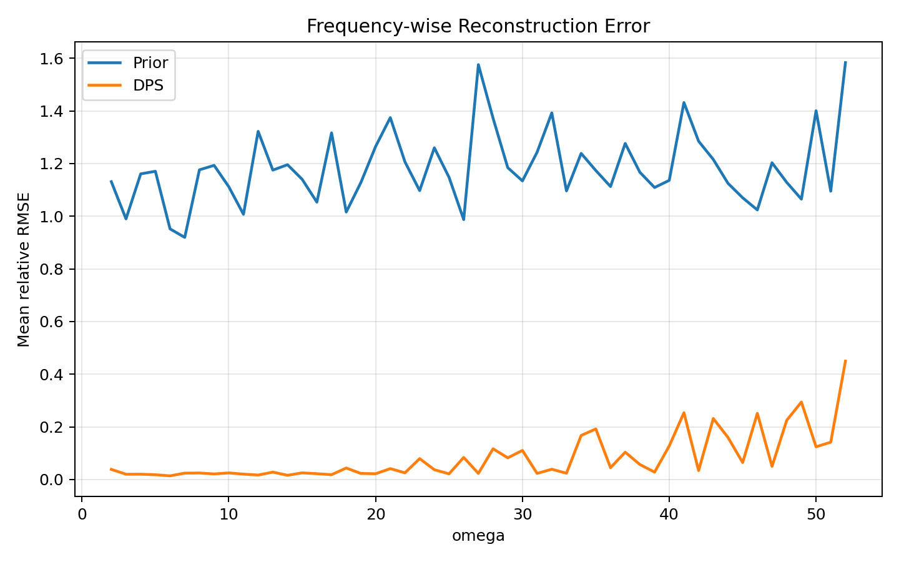
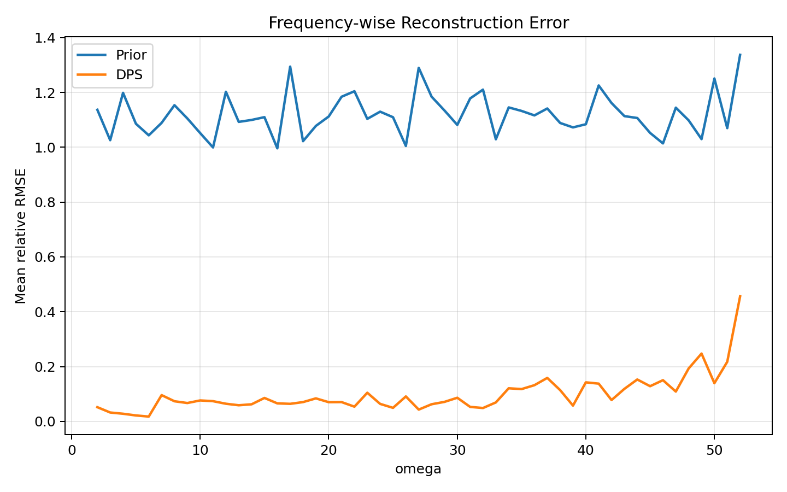

---

## 3. 2D Helmholtz — 消融实验

**数据集：** `mask2.h5` / `mask5.h5`（各 102 case）  
**测试日期：** 2026-05

| 消融变体 | mask ratio | RMSE | 说明 |
|----------|:----------:|-----:|------|
| Ours（完整） | 2% | 0.098 | DPS + PDE引导 + ω条件 |
| Ours（完整） | 5% | 0.081 | |
| w/o DPS（仅 PDE 引导） | 2% / 5% | 0.921 | 去掉 DPS 引导，仅留 PDE，效果断崖 |
| w/o PDE（仅 DPS） | 2% | 0.204 | 去掉 PDE 引导，略差 |
| w/o PDE（仅 DPS） | 5% | 0.074 | 在 5% 时影响较小 |
| w/o ω condition | 2% | 0.068 | 去掉频率条件 |
| Uncond（无引导） | 5% | NaN | 无引导时扩散发散 |

---

## 4. 2D 弹性波

**数据集：** `elastic_dataset_msk{0.01,0.02,0.05,0.1}.h5`（每个 70 case，C=4 通道：ux_re/im, uy_re/im）  
**说明：** 各样本材料参数 (λ, μ, ρ) 随机变化，域内有随机障碍物

### 4.1 全场相对 RMSE（Mean Rel. RMSE，↓）

| 方法 | msk 1% | msk 2% | msk 5% | msk 10% |
|------|-------:|-------:|-------:|--------:|
| **Ours (FTM+Diff)** | **0.566** | **0.428** | **0.338** | **0.305** |
| LRTFR | 0.601 | 0.391 | 0.155 | 0.090 |
| FNO | 1.046 | 1.015 | 0.921 | 0.775 |
| F-FNO | 1.019 | 1.019 | 1.019 | 1.019 |
| VoronoiCNN | 0.478 | 0.315 | 0.181 | 0.121 |
| DiffusionPDE | 0.741 | 0.533 | 0.259 | 0.157 |
| CoNFiLD | 2.696 | 2.673 | 2.606 | 2.508 |

> **备注：**
> - CoNFiLD 在弹性波上完全失败（RMSE ≈ 2.5–2.7），F-FNO 也基本没学到有用的东西（RMSE ≈ 1.0 接近随机）。
> - VoronoiCNN 在弹性波上表现相对较好，特别是 msk 5%/10%。

### 4.2 频率曲线图

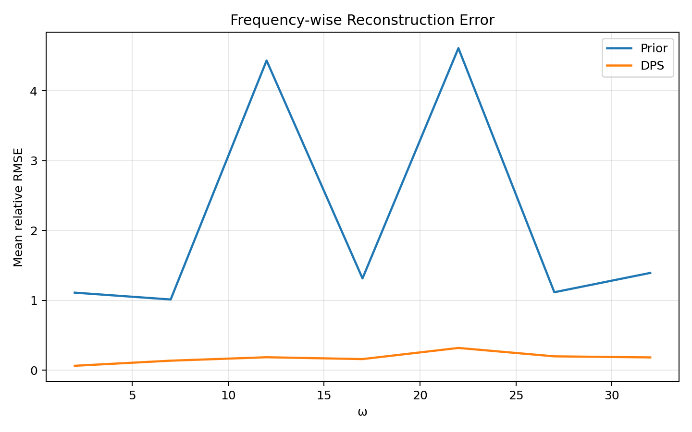

---

## 5. 3D Helmholtz

**数据集：** `helmholtz3d_dataset_msk{0.01,0.02,0.05,0.1}.h5`（FNO/VoronoiCNN/DiffusionPDE 各410 case；Ours 45 case）

### 5.1 全场相对 RMSE（Mean Rel. RMSE，↓）

| 方法 | msk 1% | msk 2% | msk 5% | msk 10% |
|------|-------:|-------:|-------:|--------:|
| **Ours (FTM+Diff)** | **0.101** | **0.080** | **0.065** | **0.060** |
| FNO3D | 1.217 | 1.212 | 1.197 | 1.170 |
| F-FNO 3D | 1.144 | 1.144 | 1.146 | 1.147 |
| VoronoiCNN 3D | 0.337 | 0.196 | 0.103 | 0.065 |
| DiffusionPDE 3D | 0.753 | 0.511 | 0.251 | 0.161 |

### 5.2 频率曲线图

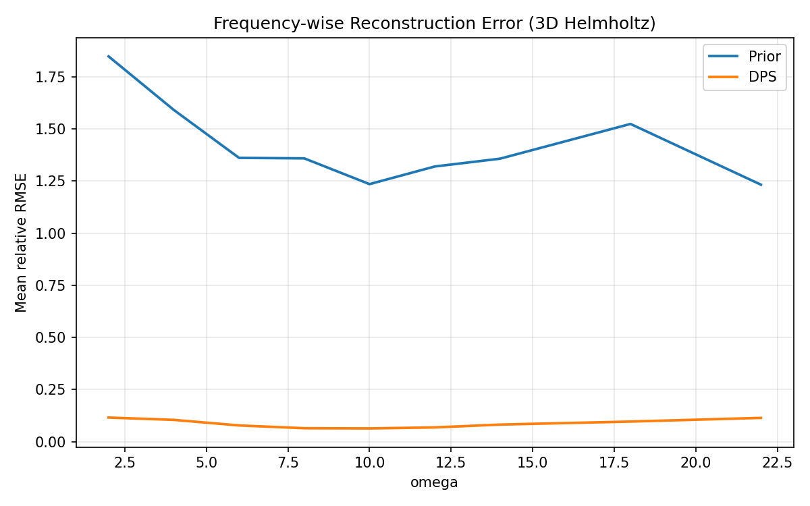

---

## 6. 自适应引导（Self-Calibrating Guidance）实验

**文件：** `test_diffusion_selfcal.py`（`test_diffusion.py` 的修改版）  
**测试日期：** 2026-06-13

| 变体 | RMSE（Orig） | RMSE（SelfCal） | 改变 | 说明 |
|------|------------:|----------------:|-----:|------|
| v1：放大 obs 残差 | 0.198 | 0.253 | **-27.7%** | 高残差时 boost 过大，高频发散 |
| v2：保守（仅衰减 obs 权重） | 0.198 | 0.210 | -6.2% | 末段引导被过度减弱 |
| v3：固定 DPS 权重，仅调 PDE 权重 | — | — | — | 运行时 PDE 引导发散（NaN）|

**当前结论：** 自适应引导目前对结果有轻微负影响（-6%）。主要问题：
1. `r_obs` 在整个采样过程中不单调下降，无法作为可靠的"收敛信号"
2. PDE 引导本身在高频段容易发散，任何自适应放大 PDE 权重的策略都可能引发 NaN

**建议：** 暂时搁置，作为附录/ablation 提及"尝试过"；聚焦于把确定性结论跑齐（3D mask ratio，弹性波统一 checkpoint）。

---

## 7. 代表性可视化图

### 2D Helmholtz（mask 5%，第1个 case）

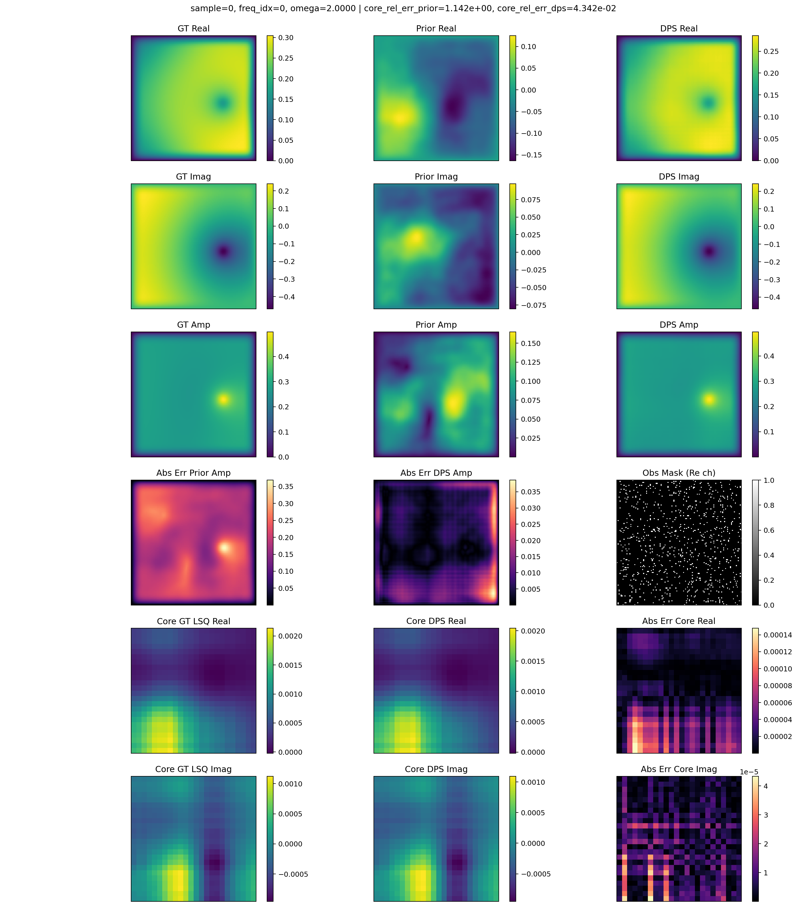

### 弹性波（第1个 case）

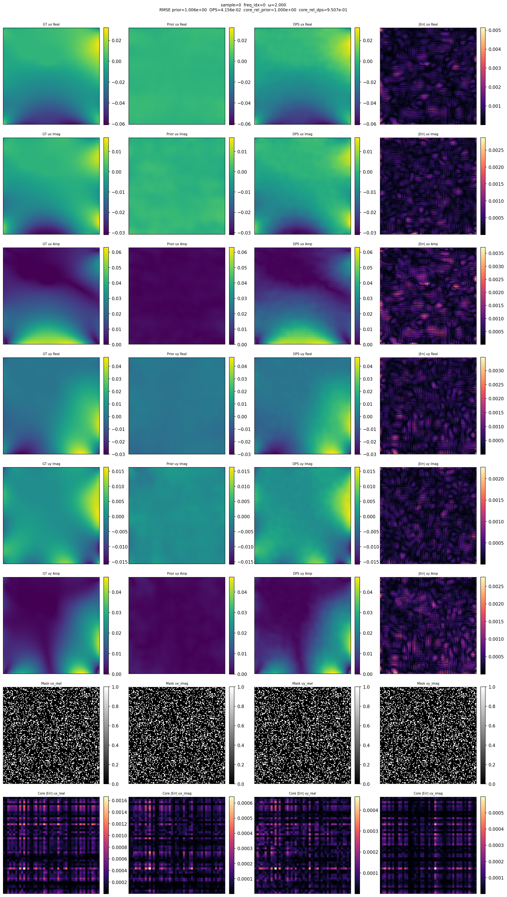

### 3D Helmholtz（第1个 case）

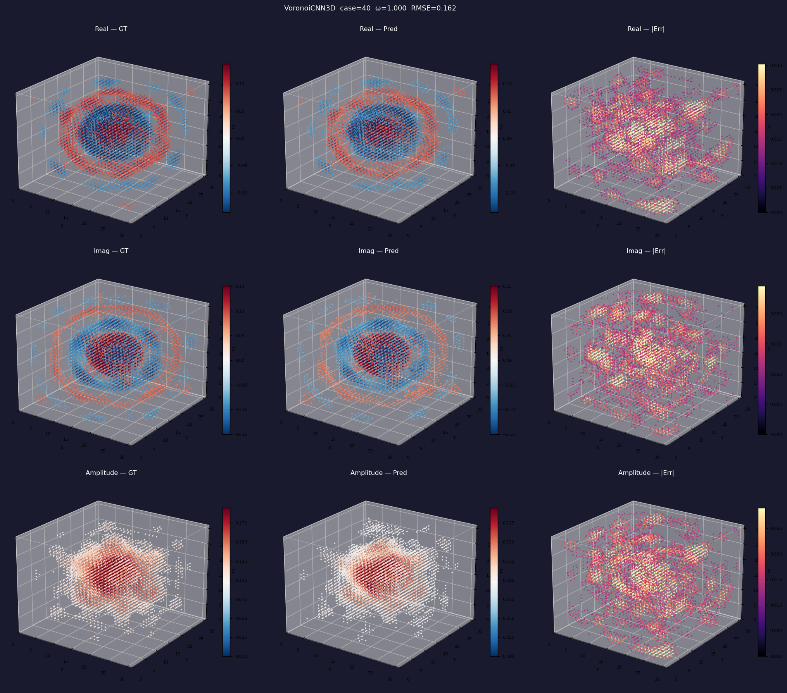

---

## 8. 下一步计划（对齐 AAAI_plan.md）

> 更新时间：**2026-06-16**  
> AAAI-27 目标截止：2026 年 8 月初（约 7 周）

### 8.1 立即要做（MUST，核心结果）

| 优先级 | 任务 | 现状 | 备注 |
|:------:|------|------|------|

| 🔴 1 | **频率外推实验（E2）** | ❌ 未做 | 核心 hero result |
| 🔴 2 | **E1 极端稀疏（mask 0.5%）** | ❌ 未做 | 当前最低为 1%；需生成 mask0.5 数据集并测试 |

### 8.2 应该做（SHOULD，审稿人质疑时的保障）

| 优先级 | 任务 | 现状 | 备注 |
|:------:|------|------|------|
| 🟡 3 | **不确定性估计（E4）** | ❌ 未做 | 多次采样 → CRPS, 覆盖率；强化"生成模型"卖点 （不一定做）|
| 🟡 4 | **E7：为什么 latent 是低秩的** | 部分有（diagnose_rank.py）| 整理成图/表 |
| 🟡 4 | **E7：频率embeding** | 部分有（diagnose_rank.py）| 整理成图/表 |

### 8.3 可以做（COULD，camera-ready 或附录）

| 优先级 | 任务 | 现状 | 备注 |
|:------:|------|------|------|
| ⚪ 5 | 异质性 Helmholtz（varying medium） | ❌ | 强化 E7 分析 |
| ⚪ 6 | Maxwell/EM 数据 | ❌ | 泛化性验证 |
| ⚪ 7 | Senseiver / Transolver baseline | ❌ | 对比更多方法 |
| ⚪ 8 | 传感器位置鲁棒性（E6） | ❌ | off-grid 测试 |
| ⚪ 9 | 自适应引导（E8）深入优化 | ⚠️ 尝试过，效果不稳定 | 作为附录 |

### 8.4 关键风险与对策

| 风险 | 影响 | 对策 |
|------|------|------|
| **自适应引导无法改善** | Contribution 3 弱化 | 降级为附录 ablation，将重点放在 Contribution 1/2 |

---

## 6.24更新

### 1. 2D Helmholtz: 频率条件编码的进一步比较（mask ratio = 10%）

近期围绕“如何在扩散先验中引入频率条件”做了一组补充实验。这里主要关注二维 Helmholtz 方程、观测掩码比例为 10% 的设置，并比较不同频率编码方式对最终重构误差的影响。

| 频率条件形式 | 说明 | 相对误差 |
| --- | --- | ---: |
| Fourier 编码 | 当前默认做法 | 0.049 |
| Fourier + $\omega$ + $\omega^2$ | 在 Fourier 基础上叠加显式多项式频率项 | 0.044 |
| $\omega$ + $\omega^2$ | 去掉 Fourier，仅保留低阶多项式编码 | 0.044 |
| $\omega$ + $\omega^2$ + 线性编码 $(k\pi)$ | 额外加入线性谱位置编码 | 0.052 |
| 仅使用 $\omega$ | 只保留最简单的标量频率条件 | 0.030 |

从目前这组结果来看，频率编码对最终重构效果**没有表现出稳定且显著的增益**。更具体地说：

1. 在当前框架下，复杂一些的 Fourier 频率编码并没有明显优于简单的显式标量编码。
2. 仅使用 $\omega$ 的最简单条件反而给出了目前最好的一组结果（相对误差 0.030）。
3. 在 Fourier 编码基础上继续叠加更高阶或线性项，并没有带来持续改进，说明“更复杂的频率特征工程”本身未必是问题的关键。

这些数值反映了目前测试阶段的整体趋势：**频率条件本身对 latent diffusion 的帮助可能比预想中弱得多**。

### 2. 一些当前的理解：为什么隐空间频率条件可能效果有限？

我现在更倾向于这样理解这个问题。

在二维 Helmholtz 问题中，频率 $\omega$ 对显空间物理场 $u(x,y;\omega)$ 的影响是直接的：PDE 本身的算子就显式依赖于频率，场的振荡模式、波长和相位结构都会随着 $\omega$ 改变。因此，在**显空间**里，频率确实是一个具有明确物理含义的变量。

但是在当前方法中，频率条件并不是加在显空间，而是加在扩散模型所建模的**隐空间核心张量**上。若记 FTM 表示为

$$
u_s(x,y,\omega_m) \approx \Phi(x,y)\, g_{s,m},$$

其中 $\Phi(x,y)$ 是共享基函数，$g_{s,m}$ 是样本 $s$ 在频率 $\omega_m$ 下对应的核心张量（或向量化后的 core）。扩散模型实际学习的是类似

$$
p(g_{s,m} \mid \omega_m)$$

问题在于，$core$ 本身是对显空间场经过基表示压缩后的结果，它对频率的响应未必仍然保留了足够清晰、可分离、可供扩散模型直接利用的结构。也就是说，

- 频率在显空间中是“物理变量”；
- 但在 latent core 空间中，它未必仍然表现为一个简单、单调、可编码的条件变量。

从这个角度看，一开始把频率条件直接加到 latent diffusion 上，可能在方法层面就不是最自然的选择。

### 3. 新尝试：把频率放到 decoder / basis 端，而不是 diffusion 端

基于上述思路，我进一步尝试了另一条路线：

- 在扩散模型阶段**不显式引入频率条件**；
- 让扩散模型学习一个与频率无关的 core 先验；
- 把频率依赖性转移到 decoder 侧，也就是让基函数随频率变化。

对应的想法可以写成：

$$
u_s(x,y,\omega_m) \approx \Phi_{\omega_m}(x,y)\, g_s,$$

其中：

- $g_s$ 是与频率无关的共享 core；
- $\Phi_{\omega_m}(x,y)$ 是关于频率条件化的基函数。

在当前第一版实现中，采用的是“共享基础基 + 频率调制”的形式，也就是分别构造

$$
\phi_x(x,\omega)=\gamma_x(\omega)\odot \phi_x^{(0)}(x)+\beta_x(\omega),
\qquad
\phi_y(y,\omega)=\gamma_y(\omega)\odot \phi_y^{(0)}(y)+\beta_y(\omega),
$$

然后通过张量积形成二维条件基：

$$
\Phi_{\omega}(x,y)=\phi_x(x,\omega)\otimes \phi_y(y,\omega).
$$

频率不再作为 diffusion 先验的显式条件，而是通过条件基函数进入最终解码过程。这样做的动机是：**如果频率的物理效应主要体现在显空间波动结构上，那么它更应该调制 basis，而不一定应该去直接调制 latent core 分布。**

### 4. 结果：decoder 侧引入频率的第一版尝试效果并不好

遗憾的是，从目前的测试情况来看，这个“频率相关 decoder / conditional basis”的第一版实现效果并不好，尚未带来预期中的提升。现阶段更像是一个验证性实验：它说明“把频率从 diffusion 端移到 decoder 端”这个想法在直觉上有一定合理性，但**当前采用的具体实现方式还不够有效**。

- FTM 条件基评估误差曲线：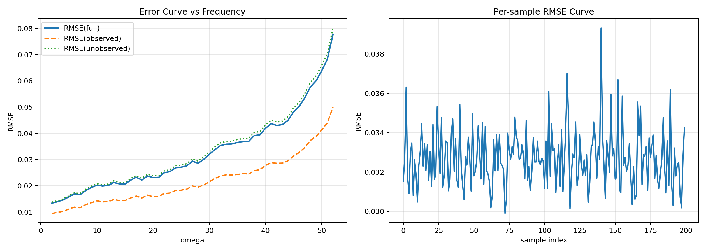
- 条件基 FTM 单例重构图：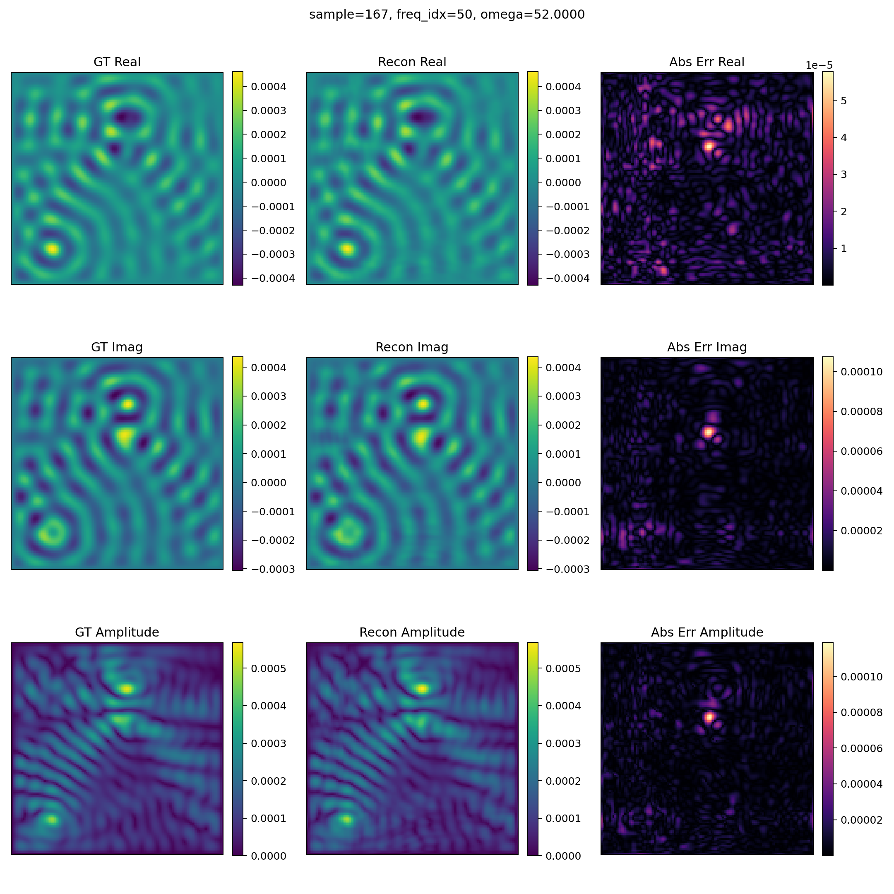
- 对应的扩散 + omega-decoder 测试示例：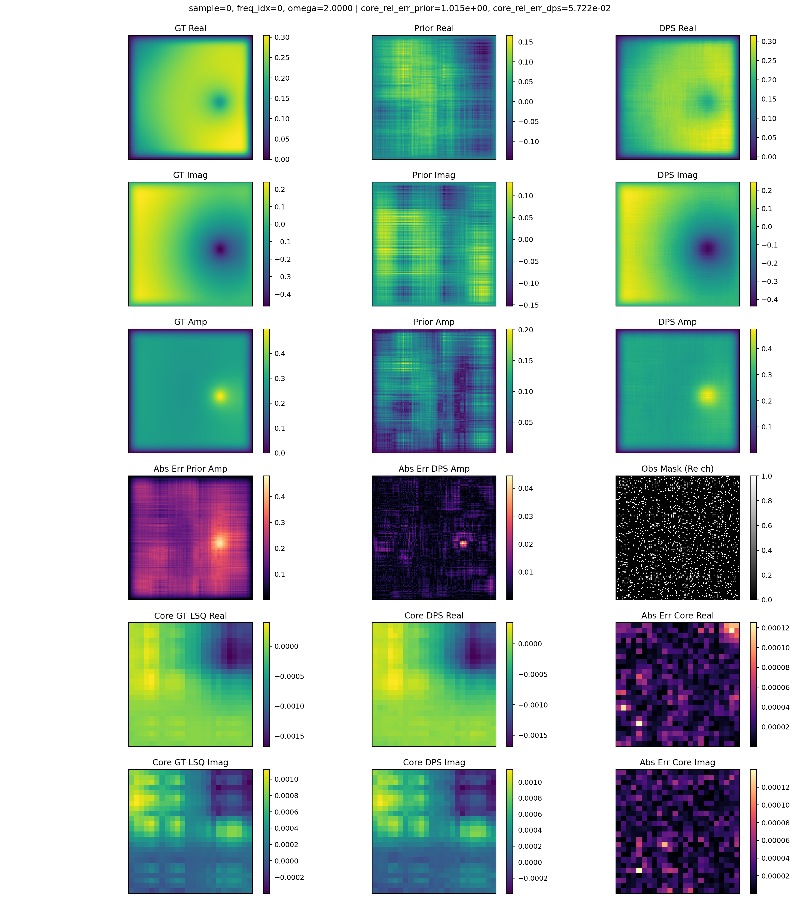

从这些结果出发，目前的判断是：**频率信息的引入方式仍然需要进一步重新设计**。后续更值得考虑的方向可能不是单纯更换编码形式，而是寻找更有物理约束意义的频率条件 / 频率先验，例如：

- 在频率轴上直接建模跨频连续性或轨迹结构；
- 将频率条件替换为更接近 PDE 算子的量（例如等效波数或与介质相关的 operator-aware 条件）；
- 在 latent prior 中显式引入跨频平滑、模态演化或谱结构先验。

换句话说，目前实验给出的一个重要信号是：**问题可能不在于“频率编码不够复杂”，而在于“频率在当前 latent 表示中的引入位置不够合理”。**

### 5. 2D Elastic wave 的补充实验

除了 2D Helmholtz 这部分外，还对 2D elastic wave 做了一些额外补充实验。一个比较明确的现象是：**在增加训练数据量之后，扩散模型先验的训练效果确实有所提升。**

这说明 elastic wave 任务里，数据量不足很可能是此前限制扩散先验性能的一个重要因素。重新训练后，从频率误差曲线可以看到，至少在一部分频率范围内，当前结果相比之前有所改善：

- 2D elastic wave 新的频率误差曲线：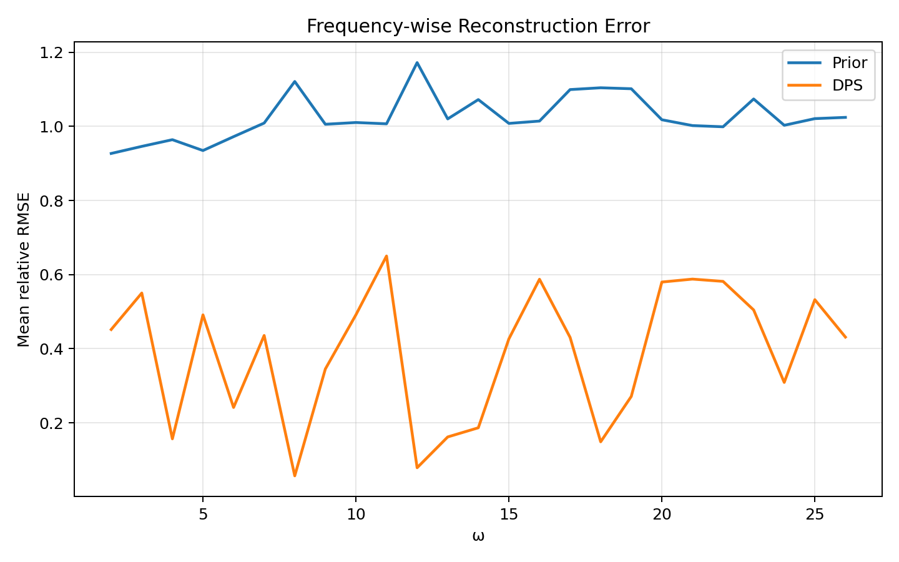

不过目前这部分提升还不是全局性的，更多表现为**部分频率段优于之前**，而不是整体指标已经完全做好。因此，2D elastic wave 这条线还需要更细致的调参，包括但不限于：

- FTM rank 的重新选择；
- diffusion 训练轮数、batch size、学习率等基础超参数；
- 频率轴上的采样策略；
- 观测掩码比例变化下的稳定性评估。

尽管如此，当前结果至少说明一个比较积极的信号：**随着数据量增加，扩散先验的方向是有效的，问题更可能出在训练充分性和参数配置上，而不是方法完全失效。**

### 6. 当前小结

截至目前，这一阶段的结论可以先概括为：

1. 在 2D Helmholtz 上，直接在 latent diffusion 中加入频率条件并没有显示出稳定增益。
2. 简单频率编码有时甚至优于复杂编码，说明问题不只是“编码表达能力不足”。
3. 将频率作用转移到 decoder / basis 端的第一版实验已经完成，但当前效果不好。
4. 因此，后续更值得投入的方向应当是：**寻找更有物理意义的频率先验或跨频结构约束，而不是继续在现有 latent 条件向量上堆叠更多频率编码。**
5. 对 2D elastic wave 而言，增加数据量后扩散先验有了可见改善，说明这条路线仍然值得继续推进。
